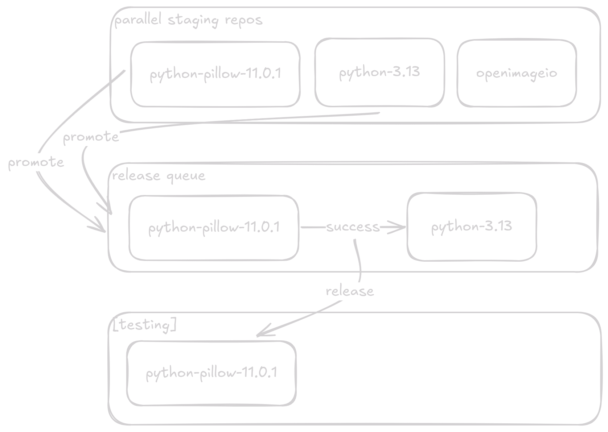
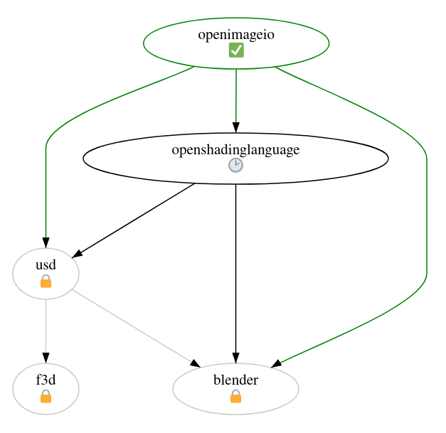

Agenda
---

<!-- pause -->
- Introduction
<!-- pause -->
- The past
- The present
- The future
<!-- pause -->
- How it works
<!-- pause -->
- Conclusion
<!-- pause -->
- Q&A


<!-- end_slide -->

Introduction
---

# buildbtw: automatic build service

<!-- pause -->
- Isolated staging repos
<!-- pause -->
- Enables multi-arch builds
<!-- pause -->
- GitLab-based collaboration
<!-- pause -->
- Easy mass rebuilds

<!-- end_slide -->

The past
---

# Packager interviews

<!-- pause -->
- We interviewed 12 packagers
- Thank you for partaking!

<!-- pause -->

## Wishlist

<!-- pause -->
- mainly CLI, complementary Web UI
<!-- pause -->
- async building, GitOps
<!-- pause -->
- automating rebuilds
<!-- pause -->
- isolated staging repos

<!-- end_slide -->

The past
---

# Prior art
<!-- pause -->
- Evaluated buildbot, koji, alpine CI, OBS 
<!-- pause -->
- Would need to fork
<!-- pause -->
- Integration seems brittle
<!-- pause -->
- Decided to build custom solution instead

<!-- end_slide -->

The present
---

<!-- pause -->
# Building a proof-of-concept

<!-- pause -->
- Local building
<!-- pause -->
- Check reverse dependencies
<!-- pause -->
- Rerun on changes
<!-- pause -->
- GitLab runner integration
<!-- pause -->
- Release queue

<!-- end_slide -->

The future
---

<!-- pause -->
# The MVP for production

<!-- pause -->
- RFC
<!-- pause -->
- async build offloading
<!-- pause -->
- local signing & releasing

<!-- pause -->
## Iterating
<!-- pause -->
- Deploy MVP ASAP
<!-- pause -->
- Keep making improvements

<!-- end_slide -->

How it works
---

<!-- column_layout: [2, 3]-->
<!-- column: 0 -->
<!-- pause -->
# Terminology
<!-- pause -->
- Namespace
<!-- pause -->
- Iteration
<!-- pause -->
- Build set

<!-- column: 1 -->

<!-- pause -->
# Components
<!-- pause -->
- API with web view
<!-- pause -->
- Build dispatcher
<!-- pause -->
- Repo manager

<!-- reset_layout -->

<!-- end_slide -->



<!-- end_slide -->

Simple usage example
---

- soname bump
```sh
pkgctl build new-namespace --name openimageio-v2.5.17.0
pkgctl version upgrade
git commit -am "Bump to v2.5.17.0"
git push
```
<!-- end_slide -->

<!-- end_slide -->

Complex usage example
---

- Python interpreter bump
<!-- pause -->
```sh
cd python
pkgctl build new-namespace --name python-v3.13
vim PKGBUILD
git commit -am "Bump to v3.13"
git push
```
<!-- end_slide -->

Complex usage example
---

- python-absl broken
<!-- pause -->
```sh
cd python-absl
pkgctl repo switch python-v3.13
vim PKGBUILD
git commit -am "Fix breakage with Python v3.13"
git push
```
<!-- end_slide -->

Stay up-to-date
---
- [buildbtw repo & issues](https://gitlab.archlinux.org/archlinux/buildbtw)
- [Matrix](https://matrix.to/#/#buildbtw:archlinux.org)

<!-- end_slide -->

Conclusion
---

<!-- pause -->
- Free up packagers' time
<!-- pause -->
- More architectures
<!-- pause -->
- Better workflows
<!-- pause -->
- More confidence

<!-- end_slide -->

Q&A
---
- Keep it **about the presentation**
- Workshop for detailed feedback after

<!-- end_slide -->

Thank you
---

<!-- column_layout: [1, 4, 1] -->
<!-- column: 1 -->
<!-- jump_to_middle -->
Let's make Arch automagic together!
